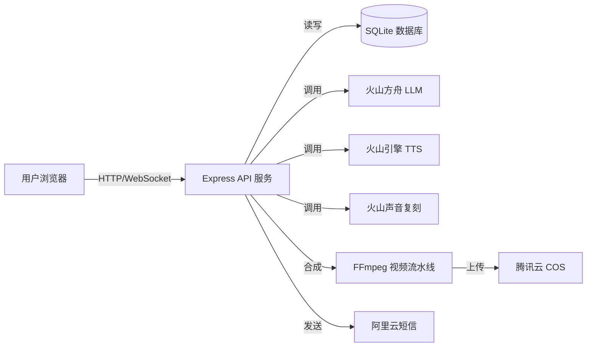

<div align="center">


# 话映 Huaying

### AI 口播视频自动生成平台

**文案 → AI 口播视频** 的自动化流水线

[](https://vuejs.org/)
[](https://www.typescriptlang.org/)
[](https://expressjs.com/)
[](https://www.sqlite.org/)
[](https://ffmpeg.org/)
[](./LICENSE.md)
[](https://github.com/Dewensong/huaying/pulls)

<br />

<table>
<tr>
<td width="33%" align="center">
  <b>📝 文案输入</b><br/>
  <sub>手动输入或 AI 自动生成</sub>
</td>
<td width="33%" align="center">
  <b>⚙️ 自动合成</b><br/>
  <sub>形象 + 声音 + 字幕 → 视频</sub>
</td>
<td width="33%" align="center">
  <b>🎬 一键导出</b><br/>
  <sub>MP4 格式，随时发布</sub>
</td>
</tr>
</table>

</div>

---

## ✨ 为什么选话映

<table>
<tr>
<td width="50%">

### 🎯 全栈开源，开箱即用

前后端完整开源，本地一条命令启动。Vue 3 + Express + SQLite，无需额外数据库配置。

</td>
<td width="50%">

### 🧠 AI 全链路覆盖

从文案生成 → 语音合成 → 视频渲染，集成火山方舟 LLM、TTS、声音复刻全套 AI 能力。

</td>
</tr>
<tr>
<td width="50%">

### 🎨 精心设计的 UI

深色主题 + 青金配色 + Glassmorphism 效果，专业的视觉体验。移动端、桌面端响应式适配。

</td>
<td width="50%">

### 🔧 灵活可扩展

模板系统保存常用配置，批量创建视频任务。WebSocket 实时推送进度，架构清晰易二次开发。

</td>
</tr>
</table>

## 🚀 核心功能

<table>
<tr>
<td width="25%" align="center">
  <h3>📝<br/>AI 文案生成</h3>
  <sub>接入火山方舟大模型，根据主题自动生成创意口播文案</sub>
</td>
<td width="25%" align="center">
  <h3>🎙️<br/>文字转语音</h3>
  <sub>火山引擎 TTS + 声音复刻，支持克隆自定义音色</sub>
</td>
<td width="25%" align="center">
  <h3>🎬<br/>视频合成</h3>
  <sub>FFmpeg 合成形象图 + TTS 音频 + 字幕，输出 MP4</sub>
</td>
<td width="25%" align="center">
  <h3>👤<br/>形象管理</h3>
  <sub>自定义上传口播头像，支持多种图片格式</sub>
</td>
</tr>
<tr>
<td width="25%" align="center">
  <h3>📋<br/>模板系统</h3>
  <sub>保存形象+声音+背景+字幕配置为一键复用模板</sub>
</td>
<td width="25%" align="center">
  <h3>📊<br/>实时进度</h3>
  <sub>WebSocket 推送任务进度，生成过程实时可见</sub>
</td>
<td width="25%" align="center">
  <h3>☁️<br/>云端存储</h3>
  <sub>腾讯云 COS 存储视频和字幕，支持 CDN 加速</sub>
</td>
<td width="25%" align="center">
  <h3>📱<br/>手机登录</h3>
  <sub>阿里云短信验证码登录，也支持邮箱注册</sub>
</td>
</tr>
</table>

## 🏗️ 系统架构



<details>
<summary>📂 点击展开项目结构</summary>

```
huaying/
├── frontend/               # Vue 3 前端 (Vite + TS + TailwindCSS + Element Plus)
│   └── src/
│       ├── modules/        # 功能模块
│       │   ├── landing/    #  Landing 页 & 营销组件
│       │   ├── auth/       #  登录 / 注册
│       │   ├── dashboard/  #  数据仪表盘
│       │   ├── video/      #  视频中心 & 创建抽屉
│       │   ├── avatar/     #  形象管理
│       │   ├── voice/      #  声音管理
│       │   ├── script/     #  AI 文案生成
│       │   └── template/   #  模板管理
│       ├── api/            # API 请求层
│       ├── stores/         # Pinia 状态管理
│       ├── router/         # Vue Router 路由
│       └── styles/         # 全局样式 & 设计 Token
├── backend/                # Express 后端 (TypeScript)
│   └── src/
│       ├── routes/core/    # API 路由 (auth/videos/avatars/voices/...)
│       ├── services/       # 业务服务 (视频流水线 / TTS / 声音克隆)
│       ├── middleware/      # 认证中间件
│       ├── db/             # SQLite 数据库初始化 & 迁移
│       └── config/         # 环境变量 & COS 配置
└── docs/                   # 文档
```
</details>

## 🛠️ 技术栈

| 层级 | 技术 | 说明 |
|:---:|------|------|
| 🖥️ 前端 | Vue 3 · Vite · TypeScript · TailwindCSS · Element Plus · Pinia | 组合式 API + 模块化路由 |
| ⚙️ 后端 | Express.js · TypeScript · better-sqlite3 · JWT | RESTful API + WebSocket |
| 🤖 AI | 火山方舟 (DeepSeek/Qwen) · 火山 TTS · 声音复刻 | 国产大模型 + 语音合成 |
| 🎥 视频 | FFmpeg · fluent-ffmpeg | 图片 + 音频 + 字幕 → MP4 |
| ☁️ 存储 | 腾讯云 COS | 视频 / 字幕云端存储 + CDN |
| 📱 短信 | 阿里云短信服务 | 手机验证码登录 |

## ⚡ 快速开始

### 前提条件

- **Node.js** ≥ 18
- **FFmpeg** (视频合成引擎)
- **火山方舟 API Key** (LLM + TTS)

### 三步启动

```bash
# 1. 克隆项目
git clone https://github.com/Dewensong/huaying.git && cd huaying

# 2. 启动后端
cd backend && cp .env.example .env   # 编辑 .env 填入 API Key
npm install && npm run dev            # → http://localhost:3000

# 3. 启动前端（新开终端）
cd frontend && npm install && npm run dev  # → http://localhost:5173
```

### 环境变量配置

<details>
<summary>📝 backend/.env 完整配置项</summary>

```env
PORT=3000
JWT_SECRET=your_secret_key

# 火山方舟 (LLM + TTS)
ARK_API_KEY=your_ark_api_key
ARK_API_ENDPOINT=https://ark.cn-beijing.volces.com/api/v3
ARK_MODEL=your_model_id

# 火山 TTS
VOLCANO_TTS_APP_ID=your_tts_app_id
VOLCANO_TTS_ACCESS_KEY=your_tts_access_key

# 火山声音复刻
VOLCANO_SPEECH_API_KEY=your_speech_api_key

# 腾讯云 COS (可选，不配则存本地)
COS_SECRET_ID=your_secret_id
COS_SECRET_KEY=your_secret_key
COS_BUCKET=your_bucket
COS_REGION=ap-beijing

# 阿里云短信 (可选)
ALIYUN_SMS_ACCESS_KEY_ID=your_access_key
ALIYUN_SMS_ACCESS_KEY_SECRET=your_secret
```
</details>

## 📸 界面预览

<table>
<tr>
<td width="50%"><b>🏠 Landing 页面</b></td>
<td width="50%"><b>📊 仪表盘</b></td>
</tr>
<tr>
<td>

- 深色主题 + 青金配色
- 点阵网格 + 动态光效
- 滚动触发动画
- 完整的产品叙事流程

</td>
<td>

- 视频生成统计
- 快捷操作入口
- 最近视频列表
- WebSocket 实时状态

</td>
</tr>
<tr>
<td width="50%"><b>🎬 视频创建</b></td>
<td width="50%"><b>🔧 配置管理</b></td>
</tr>
<tr>
<td>

- 三步创建向导
- 形象 / 声音 / 背景 / 字幕配置
- 模板一键复用
- 批量创建支持

</td>
<td>

- 形象上传管理
- 声音克隆管理
- 模板保存与编辑
- AI 文案生成器

</td>
</tr>
</table>

## 📄 许可证

本项目基于 [MIT 协议](./LICENSE.md) 开源，Fork 自 [智播坊](https://gitee.com/zhang-dongtao/zhibofang)。

---

<div align="center">

**[⭐ Star 本项目](https://github.com/Dewensong/huaying)** &nbsp;&nbsp;·&nbsp;&nbsp; **[🐛 报告问题](https://github.com/Dewensong/huaying/issues)** &nbsp;&nbsp;·&nbsp;&nbsp; **[🔀 贡献代码](https://github.com/Dewensong/huaying/pulls)**

Made with ❤️ by [Dewensong](https://github.com/Dewensong)

</div>
